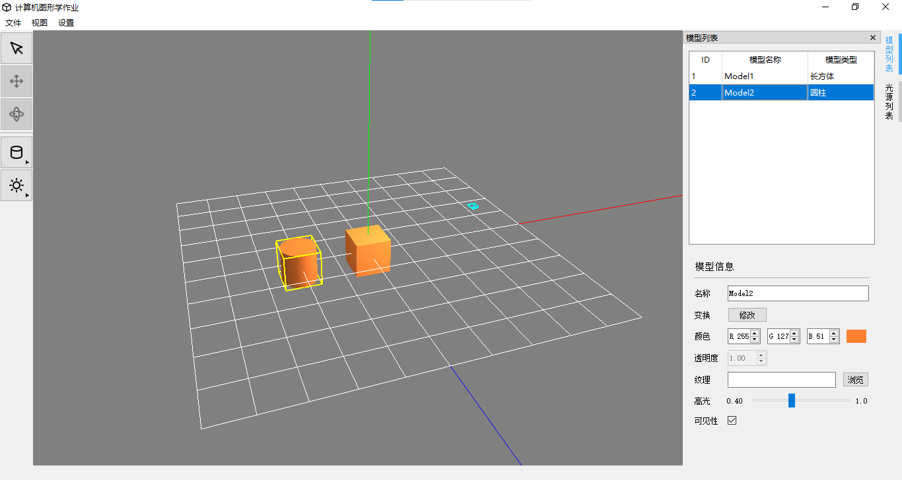

# Graphics

3D geometry shape with basic light render demo

## Build Steps

1. Download [glm](https://github.com/Groovounet/glm) and copy folder "glm" to current directory or system include directory.

2. Use **Qt** 5.x to import and build the project. You can also open and build the project in **Visual Studio** by **Qt VS Tools**.

## Notices

* You may copy folder "shader" to Qt build output directory if you see a white screen which means shaders can not be loaded.